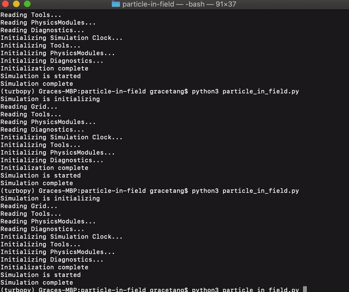

# TurboPy app for charged particle motion
[](https://zenodo.org/badge/latestdoi/272427384)
[](https://mybinder.org/v2/gh/NRL-Plasma-Physics-Division/particle-in-field/HEAD?filepath=tutorial.ipynb)

Sample turboPy app which computes the motion of an electron in an electric field.

# Installing turboPy

- Install turboPy: `pip install turbopy`

# Installing and running this app

- Clone this repository.
- Run the code:
```bash
> python ./particle_in_field.py
```



- Output is saved in `csv` format in the folder called `output`.

# Running the app in a Jupyter notebook

This sample app is also available as a [Jupyter notebook](tutorial.ipynb).

